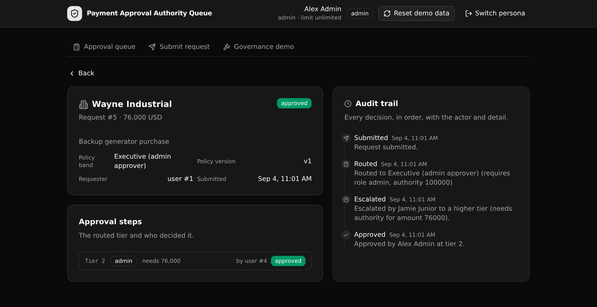

# Payment Approval Authority Queue

A governed payments approval backend where routing, per approver authority limits, and segregation of duties are enforced at the API layer, not in the frontend.

**5 tables · 8 API endpoints · 1 API group.** Native `@xanots/sdk` auth. Runs entirely on seed data, no external credentials.



## What it demonstrates

This is a **Play 3 (Pilot to Production)** proof artifact for **financial services**. It is the governed backend that would sit under a plausible AI generated internal accounts payable tool.

The one governed job: enforce approval routing and authority limits where they cannot be bypassed. A generated frontend can render any button it likes. The server still routes every request by amount to the correct approval tier, checks every approval against the approver's own authority limit, and refuses a self approval. An over limit sign off or a self approval is rejected by the API even when the request comes straight from a raw HTTP client, and every decision leaves a versioned audit trail.

That is the point an Enterprise Architect cares about. The control lives in one readable, versioned API layer they can point at and approve, so an AI built approval tool becomes safe to run in production.

Access control here is **API layer RBAC** built on native `@xanots/sdk` primitives: an auth table, `s.security.create_auth_token` at login, and per endpoint `s.precondition` guards for role, authority, and segregation of duties. It is not row level security.

## Repo layout

```
xano/
  index.ts                     the workspace, registering everything
  tables/                      users (auth), approval_policies, payment_requests,
                               approval_steps, approval_events (audit log)
  api/
    api.ts                     the API group (pinned canonical slug)
    auth-login.ts              mint a token for a persona
    payments-submit.ts         route by amount, pin the policy version, open a step
    payments-queue.ts          the queue, scoped to the caller's authority
    payments-get.ts            one request with steps, trail, and policy band
    payments-approve.ts        approve, with all three server side guards
    payments-reject.ts         reject with a reason
    payments-escalate.ts       raise a request to a higher tier
    seed.ts                    reset and load the demo data
  xano.lock                    pinned object identity (committed)
frontend/
  src/lib/api.ts               the one contract: paths and types from the defs
  src/App.tsx                  the five screens
docs/                          the landing page and screenshot
```

## API surface

Every path is served under the pinned group slug `api`, so the public prefix is `/api:api`.

| Method | Path | What it enforces |
| --- | --- | --- |
| POST | `/api:api/auth/login` | Verifies the password server side, mints an auth token for the persona |
| POST | `/api:api/payments/submit` | Routes the amount against the active policy version and pins that version to the trail |
| GET | `/api:api/payments/queue` | Returns only the requests within the caller's authority (an admin sees all, an approver sees their band) |
| GET | `/api:api/payments/get/{id}` | Returns one request with its steps, its full audit trail, and the policy band that fired |
| POST | `/api:api/payments/approve` | Checks role, the authority limit, and segregation of duties before it advances the request |
| POST | `/api:api/payments/reject` | Records a rejection with a reason (role and segregation of duties still apply) |
| POST | `/api:api/payments/escalate` | Raises a request past a limited approver to a higher tier |
| POST | `/api:api/seed` | Resets the tables and loads the personas, policy, and sample requests |

## Quick start

```bash
git clone https://github.com/xano-scratch/payment-approval-authority-queue
cd payment-approval-authority-queue
npm install
npx xanots login          # one time, authenticate with Xano
npm run xano:deploy       # deploys the backend and frontend, prints the live URL
```

Open the printed URL, then click **Load demo data** on the sign in screen (or send a POST to `/api:api/seed`). Every persona password is `password123`.

The four personas show the control from each angle:

- **Riley Requester** submits requests and cannot approve anything.
- **Jamie Junior** is an approver with a limited authority, so a large request is rejected and must be escalated.
- **Sam Senior** is an approver with a higher authority.
- **Alex Admin** has unlimited authority and sees every open request.

To try the governed rules directly, open the **Governance demo** screen. It lets you attempt an over limit approval and a self approval, and shows the exact API rejection each time.

## How the routing works

One policy version is active at a time. Each version is a set of amount bands, and each band names the role and the authority a request in that band needs. On submit, the server picks the band whose range contains the amount, pins that policy version onto the request, and opens the first approval step. The pinned version stays on the request, so the trail always shows which rule applied even after the policy changes later.

## FAQ

**Where does the business logic live?**
In the typed queries under `xano/api`. Routing, the authority check, and segregation of duties are all statements in those endpoints, so there is one place to read and audit the rules.

**Can the frontend bypass a rule?**
No. Every approve re-reads the caller and re-checks role, authority, and segregation of duties on the server. Calling the endpoint directly with a raw HTTP client hits the same guards.

**How is access controlled?**
API layer RBAC: an auth table, tokens minted with `s.security.create_auth_token`, and `s.precondition` guards on each endpoint. There is no row level security.

**Is this a real production system?**
No. It is a scratch proof artifact. The live preview links are ephemeral and expire. The durable artifact is this repo, which anyone can deploy for fresh links with `npm run xano:deploy`.

## Deploy notes

`npm run xano:deploy` runs a type check, builds the frontend, compiles the backend, and imports it into a live ephemeral environment with the built frontend hosted alongside it. Each deploy is a full replace of that environment, so re-deploying gives a clean slate. Commit `xano/xano.lock`: it pins each object's identity so a later rename updates the object in place instead of dropping and recreating it.
